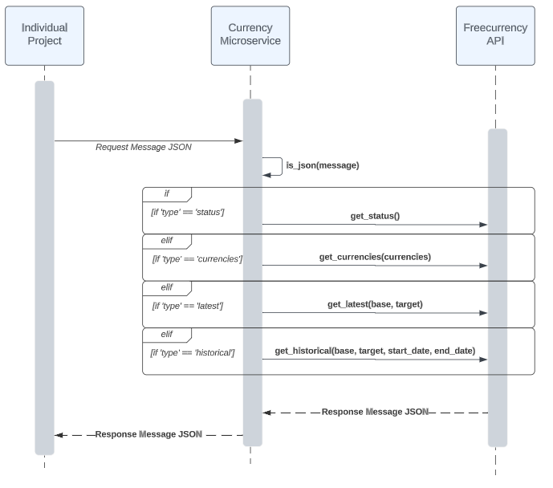

# Currency-Microservice
Dependencies:
- os
- sys
- dotenv
- dataclasses
- pika
- json
- freecurrencyapi
- requests
- datetime

## Request Format:
To communicate with the microservice, RabbitMQ is used with the queue name 'request'
Sample Connection Setup:
```
connection = pika.BlockingConnection(pika.ConnectionParameters('localhost'))
channel = connection.channel()
channel.queue_declare(queue='request')
```

Example Call:
```
latest_request = {"type": "latest", "base": "USD", target": ["CAD", "EUR"]}
message = json.dumps(latest_request)
channel.basic_publish(exchange='',
                      routing_key='request',
                      body=message)
```

- JSON format for all requests

### Status Request
Example Request:
```
message = {"type": “status"}
```

### Currencies Request
Example Request:
```
message = {"type": "currencies", "currencies": ["EUR", "USD", "CAD"]}
```
- "currencies" parameter is a list of currencies. Can be left blank (None), defaults to all currencies

### Latest Request
Example Request:
```
message = {"type": "latest", "base": "USD", "target": ["CAD", "EUR"]}
```
- base can be left blank (None), defaults to USD
- target can be left blank (None), defaults to all currencies

### Historical Request
Example Request:
```
message = {"type": "historical", "base": "USD", "target": ["CAD", "EUR"], "start_date": "2022-02-02", "end_date": "2023-07-04"}
```
- start_date and end_date must be within 366 days of each other
- date format is YYYY-MM-DD
- base can be left blank (None), defaults to USD
- target can be left blank (None), defaults to all currencies

## Response Format
To communicate back from microservice to the requesting program, RabbitMQ is used with the queue name 'response'
Sample Response Code:
```
connection = pika.BlockingConnection(pika.ConnectionParameters('localhost'))
channel = connection.channel()
channel.queue_declare(queue='response')                                                                                        ```
def callback(ch, method, properties, body):
    message = json.loads(body)      # message contains the requested data
channel.basic_consume(queue='response', auto_ack=True, on_message_callback=callback)
channel.start_consuming()
```
- RabbitMQ queue name for responses from the microservice is 'response'
- Message needs to be converted into python dictionary object with json.loads() after receiving
- See FreecurrencyAPI documentation for response format and content: https://freecurrencyapi.com/docs/

## Sequence Diagram 
